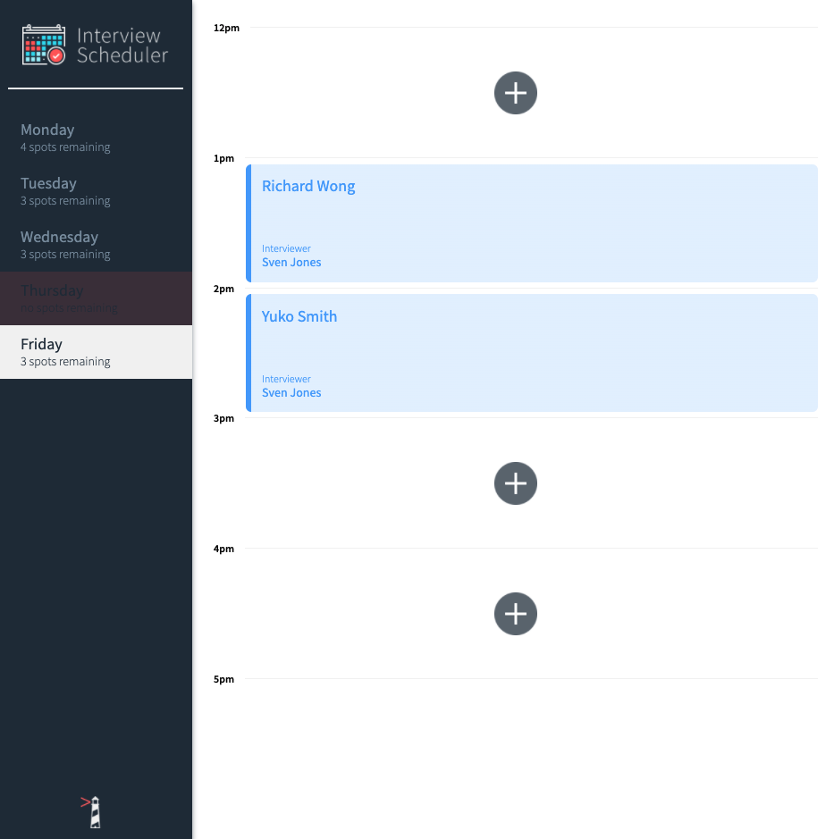
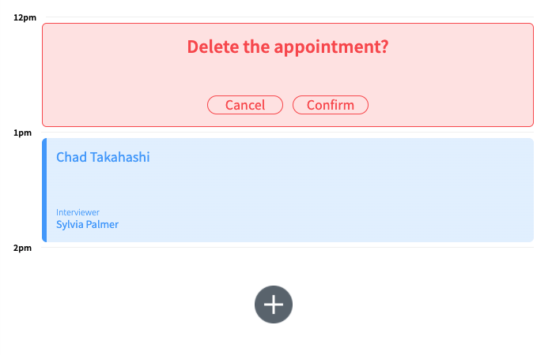

# Interview Scheduler

This is an app created for learning React. The Interview Scheduler is an app to keep track of appointments.

## Highlights:

-- spots remaining updates automatically when an appointment is created
-- saving/deleting mode when a user creates, edits, or deletes an appointment

## Images:




## Setup

Install dependencies with `npm install`.

## Running Webpack Development Server

```sh
npm start
```

## Running Jest Test Framework

```sh
npm test
```

## Running Storybook Visual Testbed

```sh
npm run storybook
```
